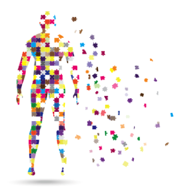
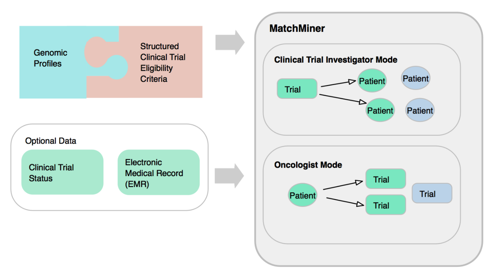

# matchminer

Developed at Dana-Farber Cancer Institute (DFCI), MatchMiner is an open source computational platform for matching patient-specific genomic profiles to precision cancer medicine clinical trials.

The input to MatchMiner is two fold: patient-specific genomic and clinical data, and structured eligibility criteria for clinical trials. Patient-specific information includes somatic genomic events, including mutations, copy number alterations, and structural variants. Basic clinical data such as cancer type, age, and sex extracted from the Electronic Medical Record (EMR) are also utilized.

Structured clinical trial eligibility criteria are specified in the Clinical Trial Markup Language (CTML), and allows the specification of genomic and basic clinical criteria described in clinical trial protocol documents.

The MatchMiner platform matches patient-specific genomic events to clinical trials, and makes the results available to trial investigators and clinicians via a web-based platform.

# documentation
Documentation for the project can be found here - (Documentation)[https://app.gitbook.com/@matchminer/s/matchminer/]

# links
* (matchminer-engine)[https://github.com/dfci/matchengine-V2]
* (matchminer-api)[https://github.com/dfci/matchminer-api]
* (matchminer-ui)[https://github.com/dfci/matchminer-ui]
