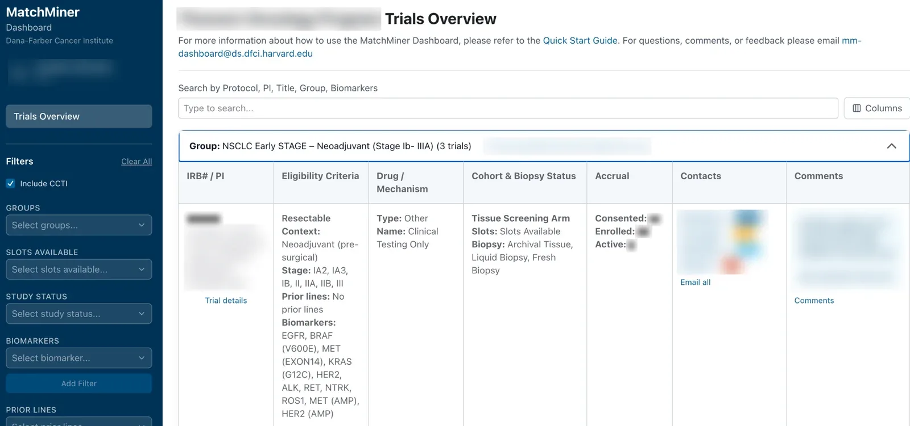

Trial teams piece together which trials are open, how many slots remain, and how accrual is going from several systems and a lot of email. MatchMiner Dashboard puts that in one place.

{.screenshot .column-body-outset fig-alt="MatchMiner Dashboard trials overview with one trial group expanded. The row shows the trial's eligibility criteria (resectable, stage IA2 to III, no prior lines, a list of biomarkers), cohort and biopsy status, and accrual fields for consented, enrolled, and active patients. A sidebar has filters for groups, slots available, study status, biomarkers, and prior lines. Names, the program name, and comments are blurred."}

## What it does

The Dashboard gives a disease center a single view of its trial portfolio:

- open and upcoming trials
- slot availability
- accrual and study milestones

Trial details come from public sources like ClinicalTrials.gov and from the center's clinical trial management system (CTMS). Teams add what those sources don't hold: eligibility notes, cohort status, contacts, and expected slots.

The Dashboard doesn't use AI. It's operational infrastructure for the people who run trials.

## Status

The Dashboard is in production at Dana-Farber across several disease centers.

Its code isn't public yet. We plan to release it as open source in winter 2026–27. [Contact the team](contact.qmd) if you'd like to hear when it's available.
