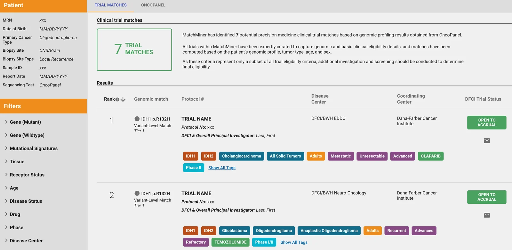
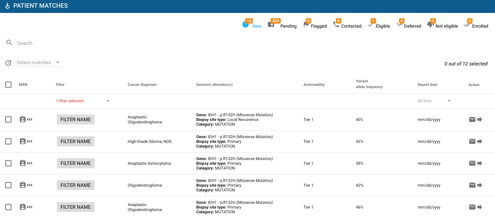

Precision medicine trials need patients with specific genomic alterations, and those patients are hard to find by hand. MatchMiner Genomics curates each trial's eligibility into a structured format, Clinical Trial Markup Language (CTML), and a rules engine checks every patient's clinical sequencing results against it. It works both ways: trials for a patient, and patients for a trial.

::: {.demo-panel .column-body-outset}
```{=html}
<figure class="match-demo" aria-labelledby="match-demo-caption">
  <div class="ctml-window">
    <div class="ctml-bar">
      <span class="ctml-file">protocol-24-117.ctml.yaml</span>
      <span class="ctml-lang">CTML</span>
    </div>
<pre class="ctml-code"><code><span class="k">protocol_no</span>: <span class="s">24-117</span>
<span class="k">treatment_list</span>:
  <span class="k">step</span>:
    - <span class="k">arm</span>:
        - <span class="k">arm_code</span>: <span class="s">A</span>
          <span class="k">match</span>:
            - <span class="k">and</span>:
                - <span class="k">genomic</span>:
<span class="hit" style="--i:0">                    <span class="k">hugo_symbol</span>: <span class="s">EGFR</span></span>
<span class="hit" style="--i:1">                    <span class="k">protein_change</span>: <span class="s">p.L858R</span></span>
<span class="hit" style="--i:2">                    <span class="k">variant_category</span>: <span class="s">Mutation</span></span>
                - <span class="k">clinical</span>:
<span class="hit" style="--i:3">                    <span class="k">oncotree_primary_diagnosis</span>: <span class="s">Non-Small Cell Lung Cancer</span></span>
<span class="hit" style="--i:4">                    <span class="k">age_numerical</span>: <span class="s">"&gt;=18"</span></span></code></pre>
  </div>
  <div class="patient-card" aria-label="Example patient">
    <p class="patient-label">Example patient (synthetic)</p>
    <dl>
      <div><dt>Variants</dt><dd><span class="chip chip-hit">EGFR p.L858R</span> <span class="chip">TP53 p.R273H</span></dd></div>
      <div><dt>Diagnosis</dt><dd>Lung adenocarcinoma</dd></div>
      <div><dt>Age</dt><dd>64</dd></div>
    </dl>
    <p class="patient-result"><span class="dot" aria-hidden="true"></span>Matches protocol 24-117, arm A</p>
  </div>
  <figcaption id="match-demo-caption">Lung adenocarcinoma matches "Non-Small Cell Lung Cancer" because the MatchEngine walks the OncoTree hierarchy.</figcaption>
</figure>
```
:::

## How it works

MatchMiner Genomics has three open-source parts: the MatchEngine, an API, and a web interface. You supply patient data and trial criteria written in CTML.

::: {.steps .column-page}

::: {.step}
### Load patient data

Structured genomic results (mutations, copy number changes, structural variants, signatures) and clinical data, fed from your institution's pipelines.

[Patient data format](https://matchminer.gitbook.io/matchminer/deployment/patient-data)
:::

::: {.step}
### Curate trials in CTML

Curators write each trial's genomic, clinical, and demographic eligibility in CTML, a human-readable YAML or JSON format.

[CTML reference](https://matchminer.gitbook.io/matchminer/deployment/ctml-and-trial-curation)
:::

::: {.step}
### Run the MatchEngine

The engine checks every patient against every open trial arm and stores the matches. It can run nightly or whenever new data lands.

[Source on GitHub](https://github.com/dfci/matchengine-V2)
:::

::: {.step}
### Review matches

Clinicians and trial staff browse, filter, and act on matches in the web interface, inside your institution's firewall.

[Try the demo setup](https://matchminer.gitbook.io/matchminer/)
:::

:::

## Three ways to find a match

::: {.modes .column-page}

::: {.mode}
### Start from a patient

A provider or research coordinator opens one patient and sees every trial their genomic and clinical profile matches.
:::

::: {.mode}
### Start from a trial

Trial staff save a filter for their trial's eligibility and get a running list of patients who fit, updated as new patients are sequenced.
:::

::: {.mode}
### Search trials directly

Staff search open trials by gene, variant, or diagnosis to review options for an individual alteration by hand.
:::

:::

::: {.column-body-outset}
{.screenshot fig-alt="MatchMiner Genomics patient view. A sidebar shows patient details with placeholder values and filters for gene, tissue, age, drug, phase, and disease center. The main panel reports 7 trial matches based on OncoPanel results and lists them by rank. Each lists the matching alteration (IDH1 p.R132H, variant-level match), the disease center, an open-to-accrual status, and colored tags for genes, cancer types, drugs, and phase."}

{.screenshot fig-alt="MatchMiner Genomics patient matches list for a saved filter. Status tabs across the top: new, pending, flagged, contacted, eligible, deferred, not eligible, enrolled. Each row shows a placeholder MRN, the filter name, a cancer diagnosis such as anaplastic oligodendroglioma, the IDH1 p.R132H mutation, tier 1 actionability, variant allele frequency around 40 percent, and buttons to email or open the match."}
:::

## At Dana-Farber

MatchMiner Genomics has been in clinical use at Dana-Farber since 2016. It reads results from Dana-Farber's OncoPanel sequencing and now also from Exact Sciences OncoExTra.

::: {.impact}
<p class="impact-caption">At Dana-Farber, January 2022</p>

<dl class="impact-list">
<div><dt>~170</dt><dd>open precision medicine trials curated in CTML</dd></div>
<div><dt>84%</dt><dd>of patients had at least one trial match</dd></div>
<div><dt>220+</dt><dd>patients enrolled on a trial as a result of MatchMiner</dd></div>
</dl>
:::

The design and these results are described in Klein H. et al., [MatchMiner: an open-source platform for cancer precision medicine](https://doi.org/10.1038/s41698-022-00312-5), *npj Precision Oncology* 2022;6:69.

## Run it at your institution

MatchMiner Genomics is free to deploy. A small instance runs on a laptop. [Get started](get-started.qmd#genomics) covers the data, infrastructure, and people you'll need.
