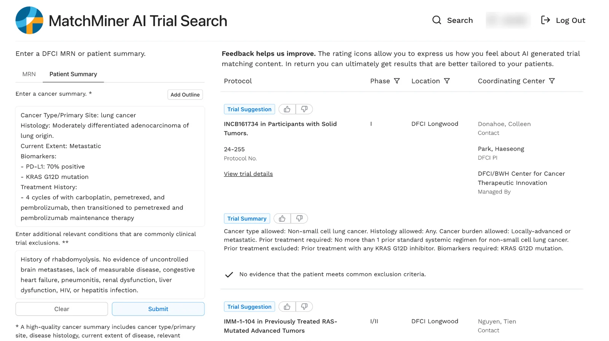
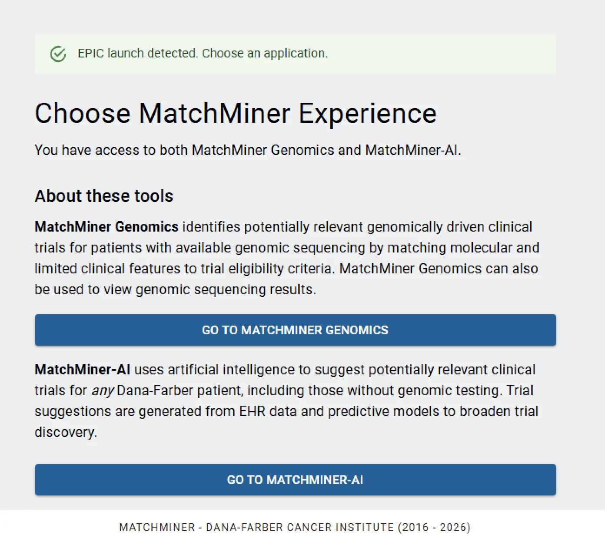

Most eligibility criteria, such as prior lines of therapy, performance status, organ function, and extent of disease, are recorded in free-text clinical notes rather than structured fields, where genomic matching can't use them. MatchMiner-AI reads them from the notes.

## How it works

MatchMiner-AI uses large language models to read a patient's clinical notes, keep a running summary of their history, and match them against all open trials, not only genomically driven ones. It suggests candidate trials, each with a plain-language summary, and the oncologist decides what to pursue.

{.screenshot .column-body-outset fig-alt="MatchMiner-AI trial search. On the left, a typed cancer summary: metastatic lung adenocarcinoma, PD-L1 70 percent positive, KRAS G12D mutation, treated with carboplatin, pemetrexed, and pembrolizumab, plus a list of exclusion conditions. On the right, suggested trials, each with phase, location, contact, principal investigator, and a plain-language trial summary with thumbs-up and thumbs-down buttons for feedback. Under one trial, a check mark says there is no evidence the patient meets common exclusion criteria."}

The released models include three families:

- **TrialSpace** finds candidate trials for a patient.
- **TrialChecker** judges whether the patient meets a trial's eligibility criteria.
- **BoilerplateChecker** checks the common exclusion criteria most trials share.

## Built to be shared

MatchMiner-AI is trained entirely on synthetic medical records, so the model weights, inference code, and training data can all be released publicly. It can run entirely on your institution's own hardware, so patient records never have to leave.

- [Inference pipeline](https://github.com/dfci/matchminer-ai-inference) (`pip install matchminer-ai`) and its [documentation](https://dfci.github.io/matchminer-ai-inference)
- [Training code](https://github.com/dfci/matchminer-ai-training)
- [Models and synthetic datasets](open-source.qmd#models-and-data) on Hugging Face

## At Dana-Farber

MatchMiner-AI launched for Dana-Farber providers in February 2026. Providers can look up AI-suggested trials for their patients, based on the full medical record. It opens from Epic, alongside MatchMiner Genomics.

{.screenshot .screenshot-narrow fig-alt="A MatchMiner screen titled Choose MatchMiner Experience, under a banner reading EPIC launch detected. It describes MatchMiner Genomics, which matches genomic sequencing results to trial criteria, and MatchMiner-AI, which suggests trials for any Dana-Farber patient, including those without genomic testing. Each has a button to open it."}

It took second place in the 2026 Hearst Health Prize and was selected for the first cohort of Meta's Llama Impact Grants in 2024.

## Randomized studies

In a randomized trial run from 2023 to 2024, AI flagged patients whose cancer was progressing, and their oncologists received emails about trial matches from MatchMiner Genomics. The AI reliably spotted patients likely to need a new treatment, but the emails alone didn't raise enrollment ([JAMA Network Open, 2025](https://jamanetwork.com/journals/jamanetworkopen/fullarticle/2833029)).

[OPTIONS-ACTIVATE](news/posts/2026-options-activate.qmd), which began recruiting in 2026, is the first randomized study of MatchMiner-AI's matching, and is designed around that result. When MatchMiner-AI detects progression, the oncologist gets a ranked list of possible trials drawn from the whole record.

## Run it at your institution

MatchMiner-AI is free for non-commercial use. [Get started](get-started.qmd#matchminer-ai) covers what it needs: hardware, a language model, trial data, and patient notes.

## Read more

Altreuter J. et al., [MatchMiner-AI: An Open-Source Solution for Cancer Clinical Trial Matching](https://arxiv.org/abs/2412.17228). arXiv:2412.17228 (2024).
