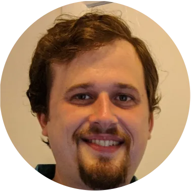

MatchMiner started in 2016 as a collaboration between software engineers, data scientists, and clinicians at Dana-Farber. The same group runs it in production for Dana-Farber's clinicians and trial staff and maintains the open-source project.

```{=html}
<div class="team-grid">
  <div class="person">
    <div class="avatar" aria-hidden="true">MH</div>
    <p class="person-name">Michael Hassett</p>
  </div>
  <div class="person">
    <div class="avatar" aria-hidden="true">JL</div>
    <p class="person-name">James Lindsay</p>
  </div>
  <div class="person">
    <div class="avatar" aria-hidden="true">TM</div>
    <p class="person-name">Tali Mazor</p>
  </div>
  <div class="person">
    <div class="avatar" aria-hidden="true">JA</div>
    <p class="person-name">Jennifer Altreuter</p>
  </div>
  <div class="person">
    <div class="avatar" aria-hidden="true">EM</div>
    <p class="person-name">Emily Mallaber</p>
  </div>
  <div class="person">
    <div class="avatar" aria-hidden="true">JP</div>
    <p class="person-name">James Provencher</p>
  </div>
  <div class="person">
    <div class="avatar" aria-hidden="true">SN</div>
    <p class="person-name">Stephen Van Nostrand</p>
  </div>
  <div class="person">
    <div class="avatar" aria-hidden="true">GG</div>
    <p class="person-name">Gufran Gungor</p>
  </div>
  <div class="person">
    <div class="avatar" aria-hidden="true">MD</div>
    <p class="person-name">Michael D&rsquo;Eletto</p>
  </div>
  <div class="person">
    <div class="avatar" aria-hidden="true">JH</div>
    <p class="person-name">Jason Hansel</p>
  </div>
</div>
```

## Funding {#funding}

MatchMiner is supported by:

- Dana-Farber Cancer Institute
- the Fund for Innovation in Cancer Informatics (ICI)
- the National Cancer Institute, through R37 CA295653 (ACTIVATE, PI Kenneth Kehl) and R00 CA245899, which funded the earlier notifications trial
- Meta, through a Llama Impact Grant for MatchMiner-AI

MatchMiner-AI took second place in the 2026 Hearst Health Prize.

## Join the team {#join}

We are always looking for software engineers and data scientists who want to work on cancer informatics. [Get in touch](contact.qmd) to hear about open roles.
